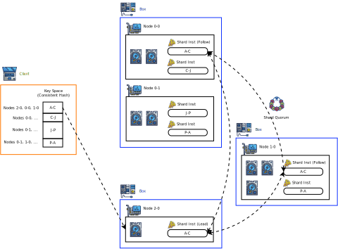

# Margate
**_A strongly-consistent key/value and object store._**

## Objectives
* Efficient for both small values (\~kBs) and large objects (\~GBs).
* Users can construct subsets of the store that are strictly serializable.
  * Operations on a single entry are linearizable.
  * Transactions and snapshots that span the same set of entries are strictly serializable.
  * Operations on different entries (outside transactions) are just serializable.
* Client-side transactions.
* Automatic entry versioning with immutable data and configurable retention.
* No dependency on clocks for correctness of live data[^1].
* Data encoding with replication or Reed-Solomon.
* Support for distributing over placement groups (e.g. racks) to reduce correlated failures.
* Support for machines with different hardware configurations.
* Focus on low latency.

[^1]: Deletion of old, non-live versions happens after a configurable time, and so depends on clock accuracy.
      Advisory locks for transactions are also timed, but timeouts cause the transaction to fail without affecting data.

## Client API
Entry:
* `entry_set(key, value, create_only?, modify_only?, at_version?, key?, old_value?) -> version, key?, old_value?`
* `entry_get(key, version=LATEST, key?) -> version, key?, value`
* `entry_delete(key, at_version?, key?, old_value?) -> success, key?, old_value?`
* `entry_size(key, version=LATEST, key?) -> version, key?, size`
* `entry_cmpxchg(key, old_value, value, key?, old_value?) -> success, key?, old_value?`

Transactions:
* `txn_begin(ranges)`
* `txn_rollback()`
* `txn_commit()`

Keys:
* `range_list(key_low, key_high, values?) -> keys, values?`
* `range_count(key_low, key_high) -> count`
* `key_get(key) -> key (NOTE: use with non-literal keys)`

Snapshots:
* `snap_add(label, key_low, key_high)`
* `snap_del(label) -> success`

A key object can be a:
* `literal string`
* `child_min(literal string)`
* `child_max(literal string)`
* `child_next_b64u(literal string) (NOTE: this key never exists at the time of calling)`
* `lower_bound(literal string)`
* `higher_bound(literal string)`

A version object can be a:
* `literal version number`
* `literal snapshot label`

## Architecture (Logical overview)
The system is structured around a few concepts:
* _Key Space_: all possible keys, from the empty string to the maximum length string (16kB).
* _Shards_: a contiguous range of keys in the key space; the range can vary over time.
* _Consistent Hash_: a set of Shards that cover the entire Key Space.

Data follows the following logical distribution:


* _Shard Services (ShardS)_
  * Each ShardS owns the storage and operation for a Shard.
  * Each ShardS is made up of individual Instances, which interact together to form a quorum.
  * The number of ShardSes scales up and down based on load.
  * A ShardS typically accounts for a small amount of data, much less than a full machine's worth.

* _Directory Service (DirS)_
  * The single DirS for the store maintains the main copy of the Consistent Hash and related mappings.
  * DirS tracks the load of ShardSes, and triggers rebalances by moving ranges to different ShardSes.
  * DirS also manages replaments when ShardSes become unavailable.
  * DirS is also a quorum of several Instances.

* _Client_
  * The Client is a thick library that is hosted by the user.
  * Clients cache the Consistent Hash locally by retrieving it from the DirS, and drive operations on the ShardSes.
  * Clients also broker multi-key transactions across multiple ShardSes.

* _Proxy_ (potential future addition)
  * Proxies cache the Consistent Hash like a Client, but are standalone services. Clients talk to Proxies instead of ShardSes.
  * In large deployments, they reduce memory load on user machines at the cost of an extra network hop.

## Architecture (Physical overview)
The physical layout depends on a few more concepts:
* _Boxes_
  * A Box is a storage appliance (server) that participate in the store.
  * It's OK to have Boxes of different capacity and/or shape, but ideally the ratio between resources on a Box matches usage.
* _Nodes_
  * A Node roughly corresponds to a NIC.
  * Ideally, a Node manages one NIC and all the CPUs and Storage Media corresponding to a single NUMA node.



As a reminder, Shards contain a small amount of data, so a Node manages many dozens of them.
Shards effectively act like virtual nodes in consistenet hashing terminology;
this allows the efficient use of Boxes with different shapes, as each will run different amounts of ShardSes.

The failure of a Node will remove one Shard Instance from many ShardSes.
The system minimizes the number of ShardSes that share the same Nodes, so the failure of two Nodes should not remove
two Shard Instances from any one ShadSes.

## Rebalancing
DirS tracks the load for each Node in several different resources, e.g.:
  * Network bandwidth [B/s]
  * Storage Media throughput (NVMe SSDs, SATA SSD or SATA HDD) [B/s]
  * Storage Media space [B]

Individual Node utilization is compared to the average across all Nodes, and priority is given to rebalancing Shards
in Nodes that are very hot or very cold.
Actual rebalancing happens then at the level of Shards, which exchange key ranges with other Shards.

Shards reduce their load by receiving a new Shard from DirS, and passing ownership of part of their key range to the new Shard.
Small adjustments may also happen by moving range with adjacent Shards.
Underused Shards transfer their key range to their adjacent Shards, and return their resources to the DirS.

## Versioning and garbage collection
All data written to the store is immediately immutable, and a new version is created for each change.
Users can retrieve data at previous versions simply by requesting the specific version in the query.

Users are also able to create a snapshot for a given range of keys. The snapshot is guaranteed to happen before or after
any other operation on that range of keys, and records a consistent view of these keys. Queries can specify the
snapshot instead of the version to retrieve the revision right before the snapshot was created.

Key versions needed for snapshots remain available as long as the snapshots themselves, plus an additional period of time.
The current version is never deleted, and all other versions are removed after they were replaced by a newer version
for at least a period of time.

Picking the right settings is very important when entries are expected to change quickly, to avoid
the excessive accumulation of old versions.

## Large object support
Large objects have sizes starting from O(100kB). Representing them as a single entry would make it harder to resize Shards;
so, an entry is rendered as:
* many entries corresponding to chunks of the value;
* an entry for their metadata, including the key and version of the chunks that corresponds to this version of the value.

This causes renames to be copies (i.e. expensive). Another option is adding a type with a pointer and reference counting.

## Performance notes
* Long keys degrade performance. The ideal key size is O(100B); longer keys slow down operation.
* Low entropy at the beginning of the key degrades performance. If all keys start with the same long prefix, much work is wasted before the system can take actions.
* Very large writes can overflow a Node. Try to make at most O(100MB)-sized writes at a time.


## Client API Examples
```
// move()
txn_begin(["/inventory/a", "/inventory/b"])
if !(v = entry_delete("/inventory/a", old_value=true)) txn_rollback()
if !entry_set("/inventory/b", v, insert_only=true) txn_rollback()
txn_commit()
```
```
// increment()
txn_begin(["/inventory/a"])
if !(v = entry_get("/inventory/a")) txn_rollback()
if !entry_set("/inventory/a", v+1) txn_rollback()
txn_commit()
```
```
// enqueue()
entry_set(child_next_b64u("/inventory/queue/"), "some data")
```
```
// dequeue()
v = entry_delete(child_min("/inventory/queue/"), old_key=true, old_value=true)
```
```
// useless trick... move() last under tree to next
old_key = child_max("/inventory/tree/")
new_key = child_next_b64u("/inventory/tree/")
txn_begin([old_key, new_key])
if !(v = entry_delete(old_key, old_value=true)) txn_rollback()
if !entry_set(new_key, v, insert_only=true) txn_rollback()
txn_commit()
```

Copyright © Claudio A Andreoni, 2021.
